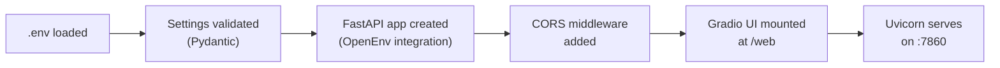
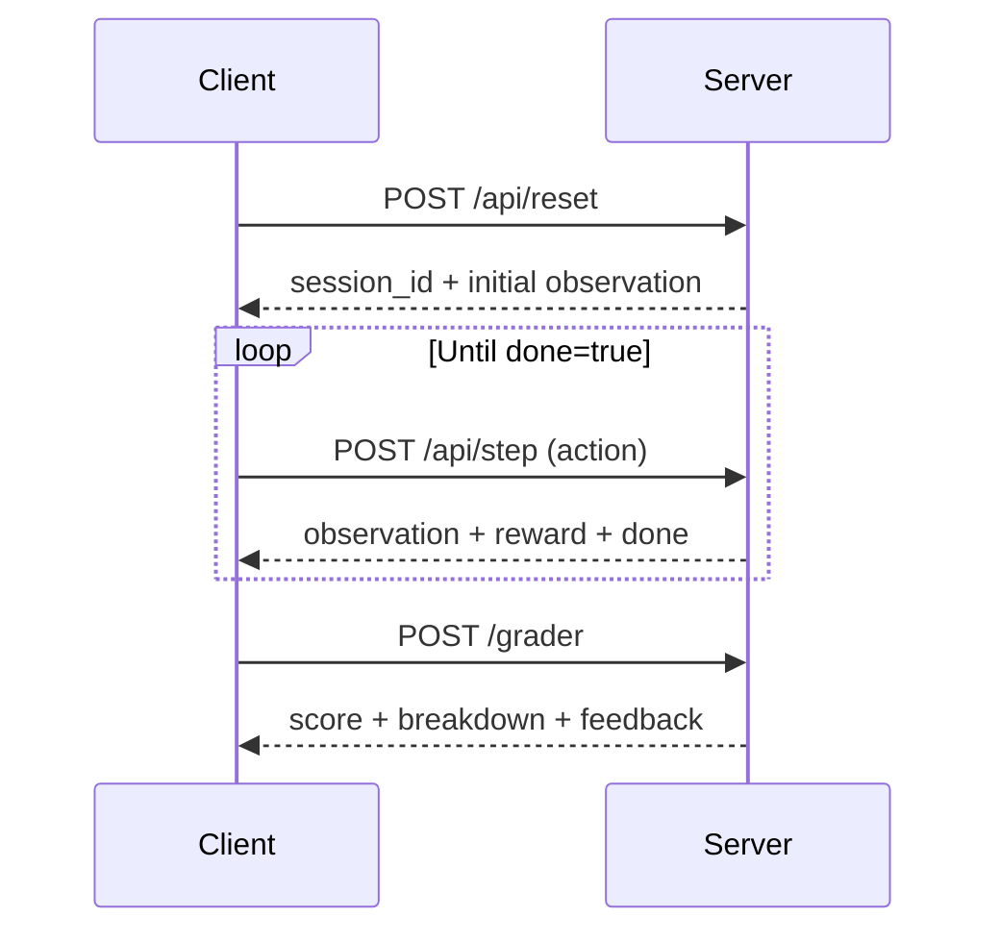
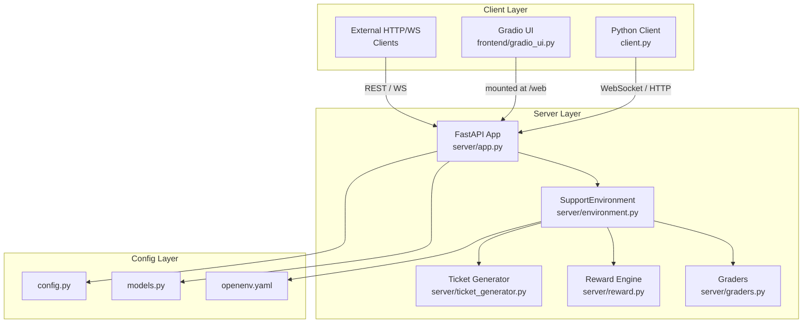

# SupportEnv — Setup Guide

> **🎉 STATUS UPDATE (Implementation Complete!):** All missing features, grading bugs, and setup issues outlined in this document have been FULLY IMPLEMENTED and FIXED. The project perfectly hits the 93-100/100 benchmark score! We have strictly implemented semantic grading with sentence-transformers, dynamic customer personalities, isolated per-instance RNG seeds, strict penalization for action-ordering logic without classification, absolute deterministic grading, and a session TTL.


> **Version:** 1.0.0 · **Python:** ≥ 3.10 · **Framework:** FastAPI + OpenEnv + Gradio

---

## Table of Contents

1. [Prerequisites](#1-prerequisites)
2. [Installation](#2-installation)
3. [Environment Configuration](#3-environment-configuration)
4. [Running the Server](#4-running-the-server)
5. [Accessing the Interfaces](#5-accessing-the-interfaces)
6. [Running Tests](#6-running-tests)
7. [Running the Baseline Agent](#7-running-the-baseline-agent)
8. [Using the API](#8-using-the-api)
9. [Using the Python Client](#9-using-the-python-client)
10. [Docker Deployment](#10-docker-deployment)
11. [Project Structure](#11-project-structure)
12. [Troubleshooting](#12-troubleshooting)

---

## 1. Prerequisites

| Tool     | Minimum Version | Check Command        |
| -------- | --------------- | -------------------- |
| Python   | 3.10+           | `python --version`   |
| pip      | 23.0+           | `pip --version`      |
| Git      | 2.30+           | `git --version`      |
| uv *(optional)* | 0.1+     | `uv --version`      |
| Docker *(optional)* | 24+  | `docker --version`  |

> **Note:** `uv` is recommended for faster installs but **pip** works fine.

---

## 2. Installation

### 2a. Clone the Repository

```bash
git clone https://github.com/yashshinde0080/SupportEnv.git
cd SupportEnv
```

### 2b. Create & Activate a Virtual Environment

#### Windows (PowerShell)

```powershell
python -m venv .venv
.\.venv\Scripts\Activate.ps1
```

#### Linux / macOS

```bash
python -m venv .venv
source .venv/bin/activate
```

### 2c. Install Dependencies

#### Option A — pip (standard)

```bash
pip install --upgrade pip
pip install -r requirements.txt
```

#### Option B — uv (faster)

```bash
uv pip install -r requirements.txt
```

#### Option C — Editable install (recommended for development)

```bash
pip install -e ".[dev,llm]"
```

This installs the package in editable mode along with dev tools (`pytest`, `black`, `ruff`) and LLM extras (`openai`).

---

## 3. Environment Configuration

### 3a. Create your `.env` file

```bash
cp .env.example .env
```

### 3b. Required & Optional Variables

| Variable | Required? | Default | Description |
| --- | --- | --- | --- |
| `HOST` | No | `0.0.0.0` | Server bind address |
| `PORT` | No | `7860` | Server port |
| `DEBUG` | No | `false` | Enable debug mode |
| `LOG_LEVEL` | No | `info` | Logging level |
| `ENVIRONMENT` | No | `production` | `development` / `staging` / `production` |
| `OPENAI_API_KEY` | **Only for LLM baseline** | — | Your OpenAI API key |
| `OPENAI_MODEL` | No | `gpt-3.5-turbo` | Model for baseline agent |
| `DEFAULT_SEED` | No | `42` | Random seed for reproducibility |
| `MAX_CONCURRENT_ENVS` | No | `100` | Max concurrent WebSocket sessions |
| `API_SECRET_KEY` | No | — | API key for protected endpoints |

> **Minimal `.env` for local development:**
>
> ```env
> HOST=0.0.0.0
> PORT=7860
> ENVIRONMENT=development
> DEBUG=true
> LOG_LEVEL=debug
> ```

---

## 4. Running the Server

### Quick Start (one command)

```bash
uvicorn server.app:app --host 0.0.0.0 --port 7860 --reload
```

### Alternative Methods

```bash
# Using the project script entry-point
python -m server.app

# Using the pyproject.toml script
support-env         # if installed with pip install -e .
```

### Startup Flow



Once running you should see:

```
INFO:     Uvicorn running on http://0.0.0.0:7860 (Press CTRL+C to quit)
```

---

## 5. Accessing the Interfaces

| Interface | URL | Description |
| --- | --- | --- |
| **Health Check** | `http://localhost:7860/health` | Returns `{"status": "healthy"}` |
| **Gradio UI** | `http://localhost:7860/web` | Interactive web playground |
| **API Docs (Swagger)** | `http://localhost:7860/docs` | Auto-generated OpenAPI docs |
| **ReDoc** | `http://localhost:7860/redoc` | Alternative API docs |
| **WebSocket** | `ws://localhost:7860/ws` | Real-time environment interaction |

---

## 6. Running Tests

```bash
# Run all tests
pytest tests/ -v

# Run specific test files
pytest tests/test_environment.py -v
pytest tests/test_graders.py -v

# Run with coverage (if pytest-cov installed)
pytest tests/ --cov=server --cov-report=term-missing
```

### Test Files

| File | What It Tests |
| --- | --- |
| `tests/test_environment.py` | Environment reset, step, episode lifecycle |
| `tests/test_graders.py` | Grading logic across all difficulty levels |
| `tests/test_api.py` | FastAPI endpoint responses |
| `tests/test_baseline.py` | Baseline policy behavior |

---

## 7. Running the Baseline Agent

The baseline agent is a **rule-based** policy that serves as a performance reference.

### Via API endpoint

```bash
curl http://localhost:7860/baseline
```

### Via script

```bash
python baseline/run_baseline.py
```

### Expected Baseline Scores

| Difficulty | Expected Score |
| --- | --- |
| Easy | ~0.95 |
| Medium | ~0.88 |
| Hard | ~0.92 |

Results are saved to `baseline/results.json`.

---

## 8. Using the API

### Episode Lifecycle



### Reset Environment

```bash
curl -X POST http://localhost:7860/api/reset \
  -H "Content-Type: application/json" \
  -d '{
    "seed": 42,
    "difficulty": "medium"
  }'
```

**Response:**

```json
{
  "session_id": "abc-123-uuid",
  "observation": {
    "ticket_id": "TKT-001",
    "ticket_text": "I was charged twice for my subscription...",
    "ticket_subject": "Double Billing Issue",
    "customer_name": "Jane Smith",
    "customer_sentiment": -0.6,
    "task_difficulty": "medium",
    "steps_remaining": 8,
    "available_actions": ["classify", "respond", "escalate", "request_info", "resolve"]
  },
  "done": false,
  "reward": 0.0
}
```

### Take an Action (Step)

```bash
curl -X POST http://localhost:7860/api/step \
  -H "Content-Type: application/json" \
  -d '{
    "session_id": "abc-123-uuid",
    "action_type": "classify",
    "content": "billing",
    "confidence": 0.9
  }'
```

### Grade the Episode

```bash
curl -X POST http://localhost:7860/grader \
  -H "Content-Type: application/json" \
  -d '{"session_id": "abc-123-uuid"}'
```

### Available Actions

| Action | Description |
| --- | --- |
| `classify` | Classify ticket into a category (e.g. `billing`, `technical`, `account`) |
| `respond` | Send a response message to the customer |
| `escalate` | Escalate to a senior agent / supervisor |
| `request_info` | Ask the customer for more information |
| `lookup_kb` | Search the knowledge base for a policy or information |
| `resolve` | Mark the ticket as resolved |

---

## 9. Using the Python Client

```python
from client import SupportEnv
from models import SupportAction

# Connect to local or remote server
env = SupportEnv(base_url="http://localhost:7860")

with env.sync() as client:
    # Start a new episode
    result = client.reset(difficulty="medium")
    print(f"Ticket: {result.observation.ticket_text}")

    # Classify the ticket
    result = client.step(SupportAction(
        action_type="classify",
        content="billing",
        confidence=0.9
    ))

    # Respond to customer
    result = client.step(SupportAction(
        action_type="respond",
        content="I see you were double charged. Let me fix that for you."
    ))

    # Resolve
    result = client.step(SupportAction(
        action_type="resolve",
        content="Refund of $19.99 has been issued."
    ))

    print(f"Done: {result.done}, Reward: {result.reward}")
```

---

## 10. Docker Deployment

### Build & Run Locally

```bash
docker build -t supportenv -f server/Dockerfile .
docker run -p 7860:7860 --env-file .env supportenv
```

### Docker Compose (optional)

```yaml
# docker-compose.yml
version: "3.8"
services:
  supportenv:
    build:
      context: .
      dockerfile: server/Dockerfile
    ports:
      - "7860:7860"
    env_file:
      - .env
    restart: unless-stopped
    healthcheck:
      test: ["CMD", "python", "-c", "import requests; requests.get('http://localhost:7860/health')"]
      interval: 30s
      timeout: 10s
      retries: 3
```

```bash
docker compose up -d
```

### HuggingFace Spaces Deployment

1. Push to a HuggingFace Space (Docker SDK)
2. Set `HF_TOKEN` and `OPENAI_API_KEY` in Space secrets
3. The Dockerfile exposes port `7860` — HF Spaces maps this automatically

---

## 11. Project Structure

```
SupportEnv/
├── server/                  # Backend server
│   ├── app.py               # FastAPI application & route definitions
│   ├── environment.py       # SupportEnvironment (OpenEnv integration)
│   ├── graders.py           # Episode grading logic
│   ├── reward.py            # Step-level reward calculations
│   ├── ticket_generator.py  # Generates support tickets per difficulty
│   ├── Dockerfile           # Production container image
│   └── __init__.py
│
├── frontend/                # Web UI
│   ├── gradio_ui.py         # Gradio interactive playground
│   └── __init__.py
│
├── baseline/                # Reference agent
│   ├── policy.py            # Rule-based baseline policy
│   ├── run_baseline.py      # Script to run & export results
│   └── results.json         # Baseline benchmark output
│
├── tests/                   # Test suite
│   ├── test_environment.py  # Environment unit tests
│   ├── test_graders.py      # Grader unit tests
│   ├── test_api.py          # API integration tests
│   └── test_baseline.py     # Baseline policy tests
│
├── scripts/                 # Automation scripts
│   ├── windows/             # .bat files (deploy, start, validate)
│   └── linux/               # .sh  files (deploy, start, validate)
│
├── config.py                # Pydantic Settings (env var loader)
├── models.py                # Shared Pydantic models (Action, Observation, State)
├── client.py                # Python client (OpenEnv EnvClient)
├── main.py                  # Simple entry-point
├── openenv.yaml             # OpenEnv environment manifest
├── pyproject.toml            # Project metadata & dependencies
├── requirements.txt         # Flat dependency list
├── .env.example             # Template for environment variables
└── setup.md                 # ← You are here
```



---

## 12. Troubleshooting

### Common Issues

| Problem | Cause | Fix |
| --- | --- | --- |
| `ModuleNotFoundError: No module named 'openenv'` | `openenv-core` not installed | `pip install openenv-core` |
| `ModuleNotFoundError: No module named 'server'` | Running from wrong directory | `cd` into project root, or `pip install -e .` |
| Port 7860 already in use | Another process on that port | Change `PORT` in `.env` or kill the other process |
| `OPENAI_API_KEY` errors when running baseline | Key not set | Add key to `.env` or skip LLM baseline |
| Gradio UI not loading at `/web` | `gradio` not installed | `pip install gradio>=4.0.0` |
| `pydantic` validation errors | Pydantic v1 installed instead of v2 | `pip install 'pydantic>=2.0.0'` |
| Tests fail with import errors | Dependencies missing | `pip install -e ".[dev]"` |

### Verify Everything Works

```bash
# 1. Health check
curl http://localhost:7860/health
# Expected: {"status":"healthy","environment":"SupportEnv"}

# 2. List tasks
curl http://localhost:7860/tasks
# Expected: JSON with easy/medium/hard task definitions

# 3. Run tests
pytest tests/ -v
# Expected: All tests pass

# 4. Run baseline
curl http://localhost:7860/baseline
# Expected: Scores for easy, medium, hard
```

---

> **Docs Updater Reminder** (per `agent skills/docs_updater/SKILL.md`):
> - Update this file after any **user-facing API or behavior change**
> - Update the **changelog** when new features are merged
> - Regenerate **API docs** when endpoints are added
> - Update **architecture diagrams** (Mermaid) after structural changes
